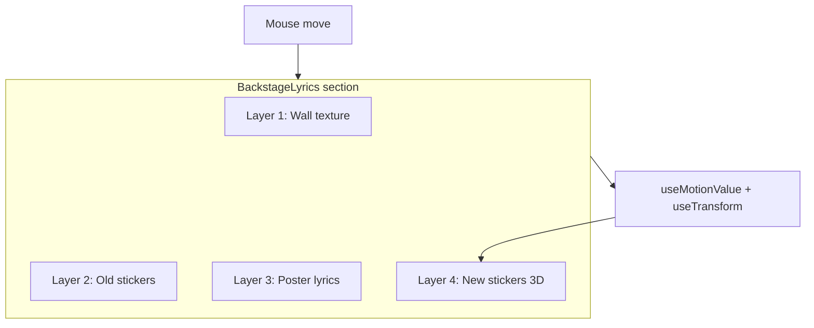

# Backstage Pass Lyrics Wall (Parallax Depth)

## Concept

A four-layer "backstage wall" effect: grimy wall background, faded old stickers, concert-poster lyrics, and glossy new stickers that tilt in 3D with mouse movement.

- **Layer 1 (Background):** Grimy concrete/brick wall texture (CSS-only).
- **Layer 2 (Old Stickers):** Faded, half-peeled stickers (vintage hymn titles or band names), irregular rotation and position.
- **Layer 3 (Lyrics):** Large, bold typography like a concert poster pasted on the wall.
- **Layer 4 (New Stickers):** Fresh, glossy stickers that "float" above and respond to mouse with 3D tilt (parallax).

**Interaction:** Mouse move over the section drives Layer 4 only: each new sticker gets `rotateX` / `rotateY` from Framer Motion `useTransform`, so they feel like vinyl stickers on glass.

---

## Architecture

- **Mouse:** Track `mousemove` on the section container. Compute normalized position (e.g. `(e.clientX - rect.left) / rect.width - 0.5` and same for Y). Feed into `useMotionValue` for `mouseX` and `mouseY`; use `useTransform` to map to `rotateX` and `rotateY` (e.g. ±6deg). Apply to all Layer 4 sticker elements via `style={{ rotateX, rotateY, transformPerspective: 1000, transformStyle: 'preserve-3d' }}` (same pattern as [LiveConsoleShowcase](frontend/components/landing/LiveConsoleShowcase.tsx)).
- **Layers:** All layers inside one `relative` wrapper. Layer 1 = base div with wall CSS. Layers 2–4 = `absolute inset-0` (or similar) so they stack; Layer 3 and 4 have higher `z-index` so lyrics and new stickers sit on top.

---

## Files to add or change

| File | Action |
|------|--------|
| [frontend/components/landing/BackstageLyrics.tsx](frontend/components/landing/BackstageLyrics.tsx) | **Create** — new client component. |
| [frontend/app/page.tsx](frontend/app/page.tsx) | **Edit** — swap `SlapLyrics` for `BackstageLyrics` (update import and usage). |

No changes to [LyricWall.tsx](frontend/components/landing/LyricWall.tsx), [SlapLyrics.tsx](frontend/components/landing/SlapLyrics.tsx), or other lyrics components; keep for revert.

---

## Component design: BackstageLyrics.tsx

- **Client component:** `'use client'`.
- **Title:** "Ready for any song" (no full stop), Framer Motion scroll-in, above the wall block.
- **Wall block:** One wrapper with `relative`, `min-height` (e.g. 480px), `overflow-hidden`, `rounded-2xl`.

### Layer 1 (Wall texture)

- Full-size div with CSS background that reads as concrete/brick:
  - Option A: Dark base (e.g. `#2a2520` or `#1c1917`) + `repeating-linear-gradient` for subtle grain or stripes (e.g. `repeating-linear-gradient(90deg, transparent 0, transparent 2px, rgba(0,0,0,0.03) 2px, rgba(0,0,0,0.03) 4px)`).
  - Option B: Multiple overlapping gradients (gray/brown tones) + low-opacity noise-like pattern. Avoid external images so it stays CSS-only and fast.
- Slight vignette or darkening at edges (optional) via radial-gradient overlay.

### Layer 2 (Old stickers)

- 3–5 absolutely positioned divs. Each:
  - Text: short hymn title or vintage-style label (e.g. "Amazing Grace", "How Great Thou Art", "Worship", "Revival").
  - Style: small font, uppercase or mixed case, `opacity: 0.5–0.65`, muted color (`text-stone-400` or similar), `transform: rotate(-6deg)` etc. (randomized per sticker).
  - "Ripped" effect: irregular shape via `clip-path: polygon(...)` or rounded corners with one corner more exaggerated; or a thin border with one side "torn" (e.g. `border` + `border-radius` asymmetric). Keep it lightweight (no image required).
- Position: scattered (e.g. top-left, top-right, bottom-left, mid-right) so they don’t fully cover the lyrics.

### Layer 3 (Poster lyrics)

- Centered block with 4–6 lyric lines (subset of LyricWall-style content).
- Typography: large (e.g. `text-2xl`–`text-3xl`), bold, high contrast (`text-white` or `text-white/95`), optional subtle `text-shadow` so it reads as pasted on the wall. Slight paper effect possible with a very subtle inner shadow or background `bg-white/5` (optional).
- `z-index` above Layer 1 and 2 so it clearly sits "on top" of the wall and old stickers.

### Layer 4 (New stickers, 3D tilt)

- 3–5 small "glossy" sticker elements (e.g. "Like", "Amen", "Worship", "Yes", or short brand phrases). Each:
  - Absolutely positioned at different spots (e.g. corners and sides), with `z-index` above Layer 3 so they float above the poster.
  - Style: `rounded-lg` or `rounded-full`, `bg-white/15` or gradient, `border border-white/25`, `backdrop-blur-sm`, small font — "fresh" and slightly glossy.
  - **3D tilt:** Each uses the same `mouseX`/`mouseY` → `rotateX`/`rotateY` (from `useTransform`). Apply via `motion.div` with `style={{ rotateX, rotateY, transformPerspective: 1000, transformStyle: 'preserve-3d' }}` and `transition` (spring) so movement is smooth. Same pattern as LiveConsoleShowcase card tilt.
- Mouse: section `ref` + `onMouseMove` / `onMouseLeave` (reset to 0). Compute normalized coordinates relative to the wall block so tilt direction is consistent.

### Accessibility

- Decorative layers (1, 2, 4): `aria-hidden="true"` where they add no semantic content. Layer 3 (lyrics) remains readable and not purely decorative; ensure contrast and no heavy animation on the text itself.

---

## Testing on localhost

1. Run frontend dev server and open the landing page.
2. Scroll to "Ready for any song"; confirm wall texture, old stickers, poster lyrics, and new stickers are all visible and stacked correctly.
3. Move the mouse over the section; confirm only the new stickers (Layer 4) tilt in 3D and that the effect resets on mouse leave.
4. Verify lyrics remain readable and that the section works on narrow viewports (responsive).

---

## Rollback

To revert: In [page.tsx](frontend/app/page.tsx), change import and component back to `SlapLyrics` (or `LyricWall`). No need to delete `BackstageLyrics.tsx` unless desired.
