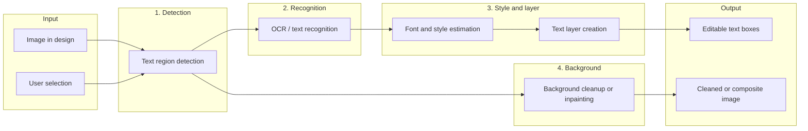

# Canva Grab Text: How It Works (Research Findings)

Evidence-based summary of how Canva’s **Grab Text** feature likely works, with a clear split between what Canva confirms and what can be inferred from behavior and public technical references.

---

## 1. Confirmed Product Behavior (from Canva Help)

Source: [Canva Help – Selecting and changing the text in your photos with Grab Text](https://www.canva.com/help/using-grab-text/?query=Grab%20Text).

### What Grab Text does (confirmed)

- **Purpose:** Select and edit text that appears *inside* photos and images.
- **Result:** Turns that text into **editable text boxes** on the design. You can change the wording and format like any other text element.
- **Entry point:** Image in design → quick actions **Edit** → **Magic Studio** → **Grab Text**.
- **Interaction:** User selects the text region(s) to process (click/drag; multiple regions possible), then clicks **Grab**. Works best when text is straight and not skewed; shooting from directly overhead or scanning documents is recommended.
- **Undo:** Undo button/shortcut or toggling Grab Text again restores the image to its original state.
- **Selection behavior:** You can choose which text to grab. Text near the selection may shift or distort; Canva recommends grabbing all text in the image or text that is close together. On iOS, selecting specific text is not yet supported.

### Where Grab Text is available (confirmed)

- **Plans:** Canva Pro, Canva Teams, Canva Education, Canva for Nonprofit.
- **Design types:** Whiteboards, Websites, Print products, Presentations, Documents (not Canva Docs), Social Media.

### Stated limitations (confirmed)

- **Scripts:** Only **Latin** text. No support for languages that do not use the Latin alphabet.
- **Geometry:** No **rotated or arched** text.
- **Formatting:** Enhanced formatting (bold, italic, underline) is not yet available.
- **Scope:** No processing of **multiple images or pages** with a single click.
- **Quality:**  
  - Sometimes creates **made-up text** from patterns or line drawings (user should delete extra text).  
  - Sometimes leaves **small text artifacts** in the image (user can remove with **Magic Eraser**).  
  - Sometimes **does not recognize** a word (user can erase with Magic Eraser and add a new text element).  
  - Tries to match **font and position**; may not be perfect—user can adjust formatting.  
  - **Adjusted transparency** can make grabbed text look strange.  
  - Occasional **errors**; Canva suggests waiting and retrying.

### Related tools (confirmed)

- **Magic Eraser:** Used to erase unwanted objects (including leftover text/artifacts) by click or brush, then **Erase**. Complements Grab Text for cleanup.
- **Magic Grab:** Isolates objects from the photo so you can move/resize them; AI regenerates the background. Different from Grab Text (which is about text → editable text boxes).

---

## 2. Likely Technical Pipeline (inferred)

Canva does not publish the internal architecture of Grab Text. The following pipeline is inferred from:

- Observed behavior (editable text boxes, artifacts, font/position matching, cleanup with Magic Eraser).
- Standard production approaches for “scene text editing” (detection → recognition → removal → re-render).
- Public work on OCR (e.g. PaddleOCR) and scene-text editing (e.g. CVPR/arXiv).

### Inferred steps

1. **Text region detection**  
   Given the image (and user selection), a model finds text regions and their rough bounds. Straight, flat text and Latin script align with what standard detection models handle well; rotated/arched and non-Latin explain stated limits.

2. **OCR / text recognition**  
   Each detected region is recognized to get the actual string. Output is the “content” that later becomes the editable text. Recognition failures and confusion with patterns explain “made-up text” and “word not recognized.”

3. **Font and style estimation**  
   Canva says it “tries to match the text in the image with a similar font and position.” So there is likely a step that estimates font/size/color/position to create a new text layer that looks similar.

4. **Editable text layer**  
   The recognized text is turned into design text elements (editable text boxes) with estimated style and position. These are the objects the user edits after “Grab.”

5. **Background cleanup (inpainting)**  
   The original pixels where the text was are removed or filled so the image looks clean under the new text. Incomplete or imperfect cleanup would explain “little artifacts” and the recommendation to use Magic Eraser. Magic Eraser is described as brushing over objects and deleting them (inpainting-style removal), which fits this role.

### Why the stated limits make sense (inferred)

- **Latin only:** Many production OCR/recognition models are trained and tuned for Latin; non-Latin scripts need different models and data.
- **No rotated/arched text:** Detection and recognition are harder for curved or rotated text; pipelines are often optimized for roughly horizontal, straight text.
- **Straight, overhead shots:** Reduces perspective and distortion, which improves both detection and recognition.
- **Artifacts / made-up text:** Recognition can hallucinate on patterns; inpainting can leave remnants or over-erase, so cleanup is a known failure mode.

---

## 3. Confirmed vs Inferred – Short Summary

| Aspect | Confirmed (Canva) | Inferred |
|--------|-------------------|----------|
| **What it does** | Converts text inside photos into editable text boxes; user can change wording and format. | — |
| **How you use it** | Select image → Edit → Magic Studio → Grab Text → select region(s) → Grab. | — |
| **Limits** | Latin only; no rotated/arched text; no multi-page; occasional artifacts, wrong or missed words; no bold/italic/underline yet. | Limits align with typical OCR + detection + inpainting failure modes. |
| **Cleanup** | Magic Eraser recommended for leftover text/artifacts. | Same inpainting/removal tech likely used for background cleanup after “grabbing” text. |
| **Pipeline** | — | Detection → OCR → font/style estimation → editable text layer + background cleanup (inpainting). |
| **Tech** | — | Not disclosed; comparable to standard scene-text detection + OCR (e.g. PaddleOCR-style) plus inpainting (e.g. Generative Fill–style). |

---

## 4. Practical Guidance: Building Something Similar

If you wanted to implement a “grab text from image and edit it” flow in your own stack, a minimal architecture would look like this:

1. **Text detection**  
   Use a model that outputs bounding boxes (or polygons) for text regions. Options: PaddleOCR detection, EasyOCR, or similar. Restrict to near-horizontal Latin if you want to ship quickly and match Canva’s reliability profile.

2. **Text recognition (OCR)**  
   Run OCR on each detected region to get the string. Same toolkits (PaddleOCR, EasyOCR, Tesseract, or a cloud OCR API) can do both detection and recognition.

3. **Font/style (optional)**  
   For “match the look,” add a step that estimates font family, size, color from the crop (e.g. simple heuristics or a small classifier). You can also default to a single font and let the user change it.

4. **Editable text layer**  
   Create text elements in your design/canvas with the recognized strings and (optionally) estimated style and position. These become the “editable text boxes.”

5. **Background cleanup**  
   Mask out or inpaint the original text regions so the image looks clean under the new text. Use an inpainting model (e.g. Stable Diffusion inpainting, or a dedicated API). A “Magic Eraser”–style brush that runs the same inpainting on user-selected areas will handle artifacts.

6. **UX**  
   Allow selection of one or more regions, “Grab” (run detection + OCR + optional style + layer creation + cleanup), then let the user edit the new text and optionally run an eraser on remaining artifacts.

Latency and quality will depend on whether you run models locally (e.g. PaddleOCR, local inpainting) or via APIs (e.g. Google Vision, cloud inpainting). Canva’s behavior suggests they run a similar pipeline server-side and keep OCR/recognition tuned for Latin and straight text.

---

## References

- [Canva Help – Grab Text](https://www.canva.com/help/using-grab-text/?query=Grab%20Text)
- [Canva Help – Magic Grab](https://www.canva.com/help/using-magic-grab/)
- [Canva Help – Magic Eraser](https://www.canva.com/help/magic-eraser/)
- [PaddleOCR – Text detection](https://paddlepaddle.github.io/PaddleOCR/main/en/version3.x/module_usage/text_detection.html)
- Scene text editing (e.g. recognition-synergistic editing, glyph-guided generation): [arXiv:2308.02905](https://arxiv.org/abs/2308.02905), [arXiv:2107.11041](https://arxiv.org/abs/2107.11041)
